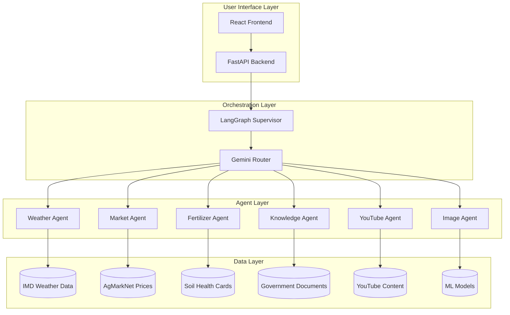
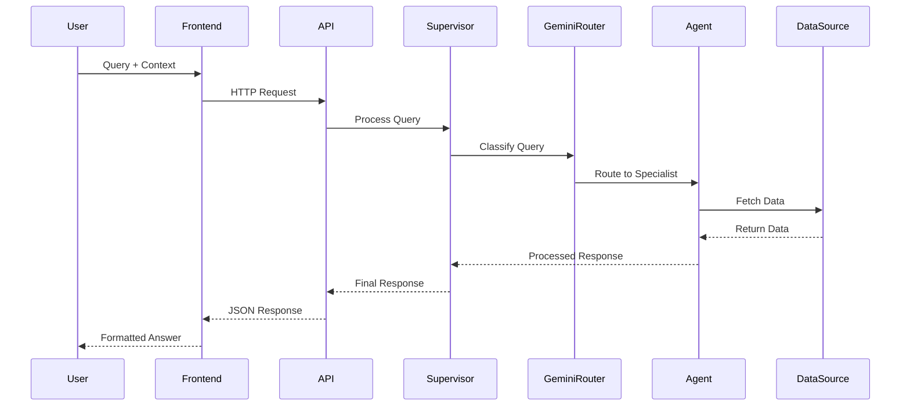

# Agricultural AI Assistant with LangGraph Supervisor

[](https://www.python.org/downloads/)
[](https://github.com/langchain-ai/langgraph)
[](https://ai.google.dev/)
[](https://opensource.org/licenses/MIT)
[](http://makeapullrequest.com)

> An intelligent, multi-agent agricultural assistant powered by LangGraph supervisor pattern and Gemini AI, designed specifically for Indian farmers and agricultural professionals. Built with government data sources and zero external API dependencies except Google's Gemini.
## 🎥 Demo Video

[](https://youtu.be/vavG5e0Nzqw)

## Table of Contents

- [Overview](#-overview)
- [Features](#-features)
- [Architecture](#️-architecture)
- [Quick Start](#-quick-start)
- [Data Sources](#-data-sources)
- [Configuration](#-configuration)
- [API Documentation](#-api-documentation)
- [Testing](#-testing)
- [Deployment](#-deployment)
- [Contributing](#-contributing)
- [Support](#-support)

## Overview

The Agricultural AI Assistant is a sophisticated, production-ready system that provides comprehensive agricultural guidance through specialized multi AI agents. Built specifically for the Indian agricultural ecosystem, it leverages government data sources and intelligent routing to deliver accurate, contextual assistance to farmers and agricultural professionals.

###  Key Highlights

- **India-First Design**: Built with Indian government data sources (IMD, AgMarkNet, Soil Health Cards,KCC queries)
- **Intelligent Routing**: Orchestration-powered query classification and agent selection
- **Multi-Agent Architecture**: Specialized agents for different agricultural subtasks
- **Production Ready**: Full-stack solution with React frontend and FastAPI backend
- **Cost Effective**: Only requires Google API key(free), all other data from free government sources
- **High Performance**: Asynchronous processing with conversation memory and user profile details.

## Features

### Core Capabilities

| Feature | Description | 
|---------|-------------|
| **Weather Intelligence** | Real-time weather data from IMD with 7-day forecasts |
| **Market Analytics** | Live commodity prices from AgMarkNet across all Indian markets |
| **Smart Fertilizer Recommendations** | Personalized suggestions based on Soil Health Card data |
| **Plant Disease Detection** | ML-powered image analysis for crop health assessment and cure |
| **Knowledge Management** | RAG system with government policies and agricultural best practices |
| **Educational Content** | Curated video recommendations for agricultural learning |
| **Contextual Conversations** | Memory-enabled chat with user profile awareness | 
| **Multi-Language Support** | Hindi and English language support |

### Specialized Agents

<details>
<summary><b>Weather Agent</b></summary>

**Data Source**: India Meteorological Department (IMD)
- Current weather conditions for any Indian location
- 7-day detailed weather forecasts
- Agricultural weather advisories
- Rainfall patterns and seasonal predictions
- Extreme weather alerts for crop protection

**Capabilities**:
- District-level weather data
- Crop-specific weather recommendations
- Irrigation scheduling based on rainfall forecasts
- Pest and disease risk assessment based on weather patterns
</details>

<details>
<summary><b>Market Agent</b></summary>

**Data Source**: AgMarkNet (Government Agricultural Marketing)
- Real-time commodity prices across 8,000+ markets
- Price trend analysis and predictions
- Market comparisons for better selling decisions
- Seasonal price patterns
- Transportation and storage cost optimization

**Capabilities**:
- State-wise and market-wise price comparisons
- Best selling time recommendations
- Price alerts for target commodities
- Market demand forecasting
</details>

<details>
<summary><b>Fertilizer Agent</b></summary>

**Data Source**: Soil Health Card Database
- Personalized fertilizer recommendations
- Soil nutrient analysis interpretation
- Organic vs chemical fertilizer guidance
- Cost-effective fertilizer combinations
- Application timing and dosage recommendations

**Capabilities**:
- Soil test report analysis
- Crop-specific nutrient requirements
- Budget-friendly fertilizer alternatives
- Micronutrient deficiency solutions
</details>

<details>
<summary><b>🔍 Image Agent</b></summary>

**Technology**: Custom-trained models on Indian crop diseases
- Plant disease identification from photos
- Pest detection and classification
- Crop health assessment
- Growth stage identification
- Deficiency symptom analysis

**Capabilities**:
- Support for 50+ common Indian crops
- Detection of 200+ diseases and pests
- Treatment recommendations with local solutions
- Severity assessment and spread prediction

<summary><b>Knowledge Agent</b></summary>

**Data Sources**: 
- Government agricultural magazines and publications
- Policy documents and scheme information
- KCC (Kisan Call Center) historical queries
- Research papers from Indian agricultural institutes

**Capabilities**:
- Government scheme eligibility and application process
- Best practices for crop cultivation
- Organic farming techniques
- Post-harvest management
- Financial assistance and subsidy information
</details>

<details>
<summary><b>YouTube Agent</b></summary>

**Technology**: Intelligent web scraping and content curation
- Educational video recommendations
- Practical farming demonstrations
- Expert interviews and talks
- Crop-specific tutorials
- Modern farming technology showcases

**Capabilities**:
- Content filtering for quality and relevance
- Language-based recommendations
- Trending agricultural topics
- Expert channel prioritization
</details>

## Architecture

### System Architecture Diagram


### Basic Sequence Diagram


## Quick Start and Setup

### Prequisites
- Python 3.8+ installed
- Node.js 16+ and npm
- Google API Key (only external dependency)
- Git for version control

**Step1**
```
git clone https://github.com/gouravanirudh05/AgriMitra

cd AgriMitra
```
**Step2**
#### Automated Setup
Our intelligent setup script handles everything automatically:
```
python setup.py
```
#### Manual Setup
##### Backend
```
# Navigate to backend
cd backend

# Create virtual environment
python -m venv venv

# Activate virtual environment
# Windows:
venv\Scripts\activate
# macOS/Linux:
source venv/bin/activate

# Install dependencies
pip install -r requirements.txt

# Setup government data sources to create faiss_store(Local vector Database)
python store.py
```
##### Environment Configuration
Create .env file in backend/ directory:
```
GOOGLE_API_KEY=your-api-key  
USE_LANGGRAPH_SUPERVISOR=true
```
##### Frontend
```
# Navigate to frontend (from project root)
cd frontend

# Install dependencies
npm install

# Start development server
npm run dev
```
##### Google API Key Setup

1. Visit the [Google Cloud Console][gcp-console]
2. Create a new project or select existing
3. Enable **Generative AI API**
4. Create API Key credentials
5. Add to your `.env` file

[gcp-console]: https://console.cloud.google.com/


Note: The Google API key is the only external dependency. All other data comes from free government sources!

## Data Sources


| Source | Type | Link |
|--------|------|------|
| KCC Call Center Dataset | Farmer FAQs (100k Q&A) | [🔗 data.gov.in](https://www.data.gov.in/resource/kisan-call-centre-kcc-transcripts-farmers-queries-answers) |
| IMD AgriMet | Weather forecasts (7-day, district-level) | [🔗 imdagrimet.gov.in](https://imdagrimet.gov.in/) |
| AgMarkNet | Market prices (3,000+ mandis) | [🔗 agmarknet.gov.in](https://agmarknet.gov.in/) |
| Mandi Prices | Daily commodity prices | [🔗 data.gov.in](https://www.data.gov.in/catalog/current-daily-price-various-commodities-various-markets-mandi) |
| Soil Health Card | Fertilizer recommendations | [🔗 soilhealth.dac.gov.in](https://soilhealth.dac.gov.in/fertilizer-dosage) |
| Farmer’s Handbook | General agricultural practices | [🔗 manage.gov.in](https://www.manage.gov.in/publications/farmerbook.pdf) |
| AgriWelfare Magazines | Government agriculture articles | [🔗 agriwelfare.gov.in](https://agriwelfare.gov.in/en/Magazine) |
| PlantVillage Dataset | 70k+ crop disease images | [🔗 Kaggle](https://www.kaggle.com/datasets/tushar5harma/plant-village-dataset-updated/data) |
| Government Schemes Corpus | PM-KISAN, PMFBY, KCC, etc. | [🔗 Kaggle](https://www.kaggle.com/datasets/jainamgada45/indian-government-schemes) |
| CGIAR Corpus | Agricultural research papers | [🔗 HuggingFace](https://huggingface.co/datasets/CGIAR/gardian-cigi-ai-documents) |

